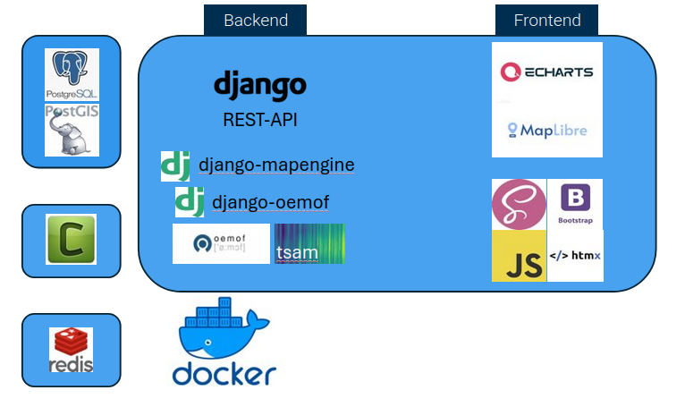

# Verwendete Technologien

## Django App "map"

Die Django App "map" bildet das zentrale Bindeglied zwischen der Benutzeroberfläche, den geografischen Daten und dem Energiesystemmodell. 
Sie ist als eigenständige Django-Anwendung innerhalb des Projekts strukturiert und verwaltet die geografischen Daten über GeoDjango-Modelle, 
darunter Verwaltungsregionen, erneuerbare Energieanlagen und verschiedene Flächennutzungsbeschränkungen. 
Die App stellt Ansichten (Views) bereit, die für die Darstellung der Kartenoberfläche und 
die Bereitstellung von Daten für verschiedene Visualisierungen (Popups, Choropleths, Diagramme) verantwortlich sind. 
Für die Kartendarstellung nutzt sie die `django-mapengine` Bibliothek (siehe [Kartendarstellung](#kartendarstellung)). 
Die Verbindung zum Energiesystemmodell erfolgt über `django-oemof` (siehe [Energiesystemoptimierung](#energiesystemoptimierung)).

## Kartendarstellung

Für die Kartendarstellung wird [Maplibre GL JS](https://maplibre.org/maplibre-gl-js/docs/) im Frontend verwendet.
Die Bibliothek ermöglicht das Darstellen von Kartenlayern aus einer Vector Tiles Quelle sowie aus einer GeoJSON.
Die Daten für die Karte werden vorab als Geopackages bereitgestellt (siehe [Datenstruktur](data_structure.md)) und 
in die Geo-Datenbank (PostGis) geladen. 
Von dort werden die Kartenlayer mithilfe der am RLI entwickelten Bibliothek [`django-mapengine`](https://github.com/rl-institut/django-mapengine) aufbereitet und der Applikation zur Verfügung gestellt.
Im Falle von Polygonen können mehrere Layer gebündelt als Multi-Vector-Tiles (MVTs) unter einer URL bereitgestellt werden (https://maplibre.org/maplibre-gl-js/docs/API/classes/VectorTileSource/).
Sollen Daten (zum Beispiel Erzeugungsanlagen) auf der Karte je nach Zoomstufe als Punkte oder geclustert dargestellt werden, benötigt maplibre-gl-js diese Daten in Form von GeoJSONs (https://maplibre.org/maplibre-gl-js/docs/API/classes/GeoJSONSource/).
In diesem Falle stellt `django-mapengine` die benötigten Daten als GeoJSONs per URL-Schnittstelle zur Verfügung.
In der Karte können außerdem [Choropleths](https://de.wikipedia.org/wiki/Choroplethenkarte) oder Popups angezeigt werden.
`django-mapengine` holt sich die dafür benötigten Daten von einer vordefinierten Schnittstelle (URL) des Programms.

## Energiesystemoptimierung

Für die Energiesystemoptimierung wird [oemof-solph](https://github.com/oemof/oemof-solph) verwendet. 
Die Daten liegen vorab als CSVs bereit und werden mittels [oemof-tabular](https://github.com/oemof/oemof-tabular) eingelesen. 
Die Integration in die Django-Anwendung erfolgt mithilfe von [django-oemof](https://github.com/rl-institut/django-oemof), 
welches die Schnittstelle zwischen der Webapplikation und dem Energiesystemmodell bereitstellt. 
Die Benutzereingaben aus der Weboberfläche werden über Hooks verarbeitet, die in der Datei `hooks.py` implementiert sind. 
Diese Hooks passen die Parameter des Energiesystemmodells entsprechend der Benutzereingaben an, bevor die Optimierung durchgeführt wird. 
Zur Reduzierung der Rechenzeit wurde [TSAM (Time Series Aggregation Module)](https://github.com/FZJ-IEK3-VSA/tsam) eingesetzt, 
um die zeitliche Auflösung der Eingangsdaten zu verringern, indem repräsentative Zeitperioden identifiziert werden.

## Weitere Technologien in der Übersicht

Schaubild der verwendeten Technologien:

### Django-App

Django ist ein leistungsstarkes Python-Webframework, das in diesem Projekt als Grundlage für die Webanwendung dient. 
Es ermöglicht die strukturierte Entwicklung der Anwendung mit einem Model-View-Template (MVT) Architekturmuster und 
bietet integrierte Funktionen für Authentifizierung, URL-Routing und Datenbankzugriff.

### Django-oemof – oemof.tabular, oemof.solph, TSAM

Django-oemof dient als Schnittstelle zwischen der Webapplikation und dem Energiesystemmodell, 
wobei oemof.tabular für das Einlesen von Daten aus CSV-Dateien und oemof.solph für die eigentliche Energiesystemoptimierung verwendet wird. 
TSAM (Time Series Aggregation Module) reduziert die Rechenzeit durch Identifizierung repräsentativer Zeitperioden, 
was besonders bei komplexen Energiesystemmodellen die Effizienz steigert.

### Django-mapengine - maplibre

Django-mapengine ist eine am RLI entwickelte Bibliothek, die die Integration von Kartenfunktionalitäten in Django-Anwendungen vereinfacht, 
während Maplibre GL JS im Frontend für die Darstellung von Kartenlayern aus Vector Tiles und GeoJSON-Quellen sorgt. 
Diese Kombination ermöglicht die interaktive Visualisierung geografischer Daten wie Verwaltungsregionen, 
erneuerbare Energieanlagen und Flächennutzungsbeschränkungen.

### PostgreSQL-DB, PostGIS

PostgreSQL dient als robuste, relationale Datenbank für die Anwendung, 
während die PostGIS-Erweiterung spezielle Funktionen für die Speicherung und Abfrage geografischer Daten bereitstellt. 
Diese Kombination ermöglicht effiziente räumliche Abfragen und die Verwaltung komplexer geografischer Informationen, 
die für die Kartendarstellung und Energiesystemanalyse benötigt werden.

### Docker

Docker wird für die Containerisierung der Anwendung und ihrer Abhängigkeiten verwendet, 
was eine konsistente Entwicklungs-, Test- und Produktionsumgebung gewährleistet. 
Die Anwendung ist in mehrere Docker-Container aufgeteilt (Django, PostgreSQL, Redis, Celery), die über Docker Compose orchestriert werden, 
was die Skalierbarkeit und Wartbarkeit verbessert.

### ECharts

ECharts ist eine leistungsstarke JavaScript-Bibliothek für Datenvisualisierung, 
die in diesem Projekt für interaktive Diagramme und Grafiken verwendet wird. 
Sie ermöglicht die ansprechende Darstellung von Energiesystemdaten, Simulationsergebnissen und statistischen Auswertungen 
mit verschiedenen Diagrammtypen wie Balken-, Linien- und Kreisdiagrammen.

### REST-Schnittstellen

Die Anwendung implementiert REST-Schnittstellen für den Datenaustausch zwischen Frontend und Backend, 
insbesondere für die dynamische Aktualisierung von Karteninhalten, Popups und Diagrammen. 
Diese API-Endpunkte liefern Daten in JSON-Format und ermöglichen eine lose Kopplung zwischen der Benutzeroberfläche und der Serverlogik.

### SCSS / Bootstrap

SCSS wird als CSS-Präprozessor verwendet, der durch django-libsass kompiliert wird, 
während Bootstrap als Frontend-Framework für responsive Layouts und vorgefertigte UI-Komponenten dient. 
Diese Kombination ermöglicht eine effiziente Entwicklung einer ansprechenden und benutzerfreundlichen Oberfläche mit konsistentem Design.

### JS

JavaScript wird für clientseitige Funktionalitäten verwendet, insbesondere für die Interaktion mit der Karte, 
dynamische UI-Elemente und die Visualisierung von Daten. 
Verschiedene JavaScript-Bibliotheken wie jQuery, PubSub-JS und ion-rangeslider ergänzen die Funktionalität und verbessern die Benutzerinteraktion.

### HTMX

HTMX ist eine moderne JavaScript-Bibliothek, die AJAX, CSS-Übergänge, WebSockets und Server-Sent Events direkt über HTML-Attribute ermöglicht. 
In diesem Projekt wird HTMX für dynamische Seitenaktualisierungen ohne vollständige Seitenneuladen verwendet, 
was die Benutzerfreundlichkeit verbessert und die Entwicklung vereinfacht.

### Celery, Redis

Celery wird als verteiltes Task-Queue-System für asynchrone Verarbeitung verwendet, insbesondere für rechenintensive Energiesystemsimulationen, 
während Redis als Message Broker und Caching-System dient. 
Diese Kombination ermöglicht die effiziente Ausführung von Hintergrundaufgaben, ohne die Reaktionsfähigkeit der Benutzeroberfläche zu beeinträchtigen.

